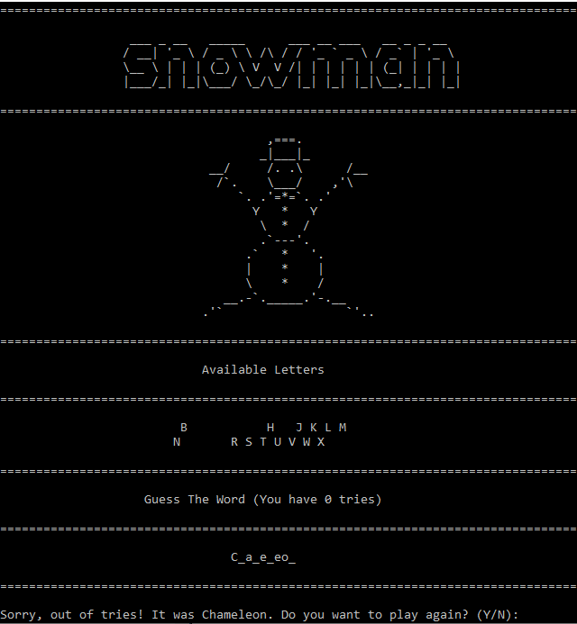

# Snowman Game :snowman::snowman_with_snow::snowman:
Play classic hangman in the terminal with a twist!! You have 8 tries to guess the correct word letter by letter before the snowman is built. Do you think you can take him on??

## Usage :newspaper:
To play the game first compile each file using:

      g++ -Wall -c -g *.cpp
Then use this command to combine the object files:

      g++ *.o
Finally an a.exe file will be created, runing using this command and you will be ready to play Snowman!:

      './a.exe or a.exe depending on which terminal you are using'
## Dependencies :milky_way:
c++:

      Check if c++ is installed: g++ -v
      Download c++ here if missing - automatic!
      [C++](https://sourceforge.net/projects/mingw-w64/)
